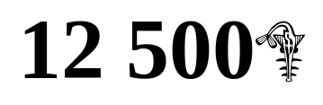

# FCFA ICON
## The iconic font and CSS framework

FCFA ICON vous permet d'utiliser le symbole du Franc CFA.

## Utilisation
```
├── css/
│   └── fcfa-icon.css
├── fonts/
│   ├── fcfa-icon.woff
│   ├── fcfa-icon.ttf
│   └── fcfa-icon.svg
├── index.html
```

HTML

`
<!-- fichier css -->
<link rel="stylesheet" href="css/fcfa-icon.css">

<!-- utilisation -->
<!-- L'icon -->
<i class="fcfa-icon"></i>

<!-- Différentes tailles -->
<i class="fcfa-icon fcfa-2x"></i>
<i class="fcfa-icon fcfa-3x"></i>
<i class="fcfa-icon fcfa-4x"></i>
<i class="fcfa-icon fcfa-5x"></i>

<!-- Exemple -->
<h1>12 500<i class="fcfa-icon"></i></h1>
`

## Licence


